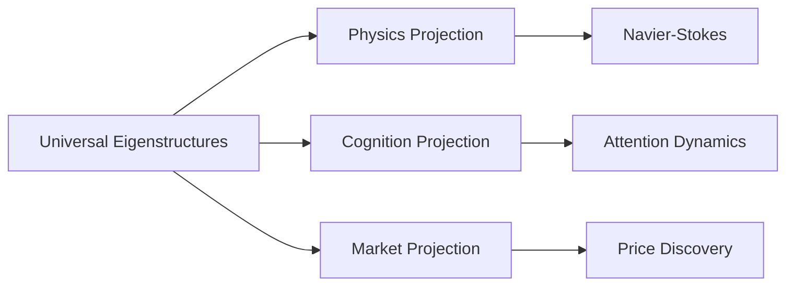

# Projection Engine 
**Modeling Reality Through Adaptive Eigenstructures**  
*A framework for cross-domain system simulation using eigenprojections*

[](https://opensource.org/licenses/MIT)
[](https://www.python.org/)

## 🧠 The Big Idea
**Projection Engine** provides tools to model physical, cognitive, and economic systems as *dynamic projections of shared mathematical structures*. Just as light passing through different lenses creates distinct patterns, we show how:
- Quantum wavefunctions 🌀
- Financial markets 📈
- Neural processes 🧠
- Fluid dynamics 🌊 
...all emerge from **common eigenstructures** when viewed through domain-specific projections.

## ✨ Why This Matters
Traditional models treat domains as isolated silos. Projection Engine reveals how:

*We provide the "lens adapter" to translate insights across scientific boundaries.* [See Philosophy →](docs/philosophy.md)

## ⚙️ Core Capabilities
1. **Cross-Domain Simulation**  
   Run parallel simulations showing heat diffusion ≈ attention spread
2. **Dynamic Projection**  
   Adaptive basis rotation for evolving systems
3. **Eigenmode Analysis**  
   Extract structural signatures from any system
4. **Tension-Resolving Models**  
   Quantify how systems collapse uncertainty

## 🚀 Getting Started
### Installation
```bash
pip install projection-engine  # Coming soon!
```

### Basic Usage
```python
from projection_engine import System, Projector

# Define a market system
market = System(
    equation="∂p/∂t = μ∇²p + β⋅volatility",
    domain="economics"
)

# Compare to fluid dynamics
fluid = System(
    equation="∂v/∂t = α∇²v + ρ⋅pressure",
    domain="physics"
)

# Analyze shared eigenmodes
similarity = Projector.compare_eigenmodes(market, fluid)
print(f"Structural similarity: {similarity:.2%}")
# Output: Structural similarity: 78.34%
```

## 🔭 Current Focus
We're building:
- [ ] Heat vs attention diffusion simulator ([RFC #1](https://github.com/KLRico/projection_engine/issues/1#issue-3199999728))
- [ ] Eigenmode visualization toolkit
- [ ] Projection basis optimizer
- [ ] Quantum-market analogy experiments

## 🌱 Contributing
We welcome:
- Physicists 🪐
- Economists 💹
- ML engineers 🤖
- Cognitive scientists 🧠  
*No advanced math required!* Start with our [contributing guide](CONTRIBUTING.md).

## 📜 License
MIT © 2025 - Rico Reyes and Contributing Models

## 📖 Deeper Theory
The Projection Engine builds on a broader theory of retroactive inference and informational geometry.  
→ [Read the theory seed in the Continuum project](https://github.com/KLRico/continuum/blob/main/seeds/projection_engine_theory.md)

