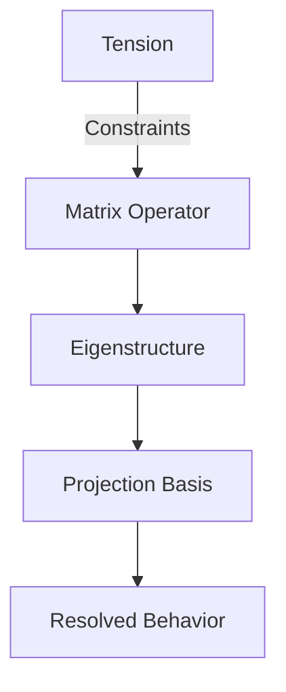

# The Philosophy Behind Projection Engine

*Why Eigenstructures Change How We Model Reality*

## 🌌 The Fundamental Insight

**Reality isn't made of things — it's made of resolutions.**
What we perceive as distinct systems (quantum fields, markets, cognition) are different projections of shared mathematical structures emerging from:

$$
\textbf{Tension} \xrightarrow{\textbf{Constraints}} \textbf{Resolution} \xrightarrow{\textbf{Memory}} \textbf{Structure}
$$

## 🔭 Our Core Principles

### 1. The Projection Principle

> *"What we observe is not nature itself, but nature exposed to our method of questioning."*
> — Werner Heisenberg

* Observation is **active projection**, not passive reception
* Every domain (physics, finance, biology) uses different "lenses"
* Projection Engine makes these lenses explicit and interchangeable

### 2. Eigenstructures as Universal Grammar

All complex systems resolve tension through:

* **Eigenvectors**: Natural vibration modes of systems
* **Eigenvalues**: Stability/persistence of those modes
* **Projection Bases**: Contextual frames determining dominant modes



### 3. The Resonance Hypothesis

Systems from different domains exhibit similar behaviors when:

```python
similarity = cosine_similarity(
    system1.dominant_eigenvectors,
    system2.dominant_eigenvectors
)
```

> When two systems "vibrate alike," they can share solutions.

High similarity in dominant eigenmodes implies shared resolution dynamics — enabling cross-domain inference:

* Market crashes ≈ phase transitions
* Neural attention ≈ heat diffusion
* Protein folding ≈ topological optimization

### 4. Reality as Adaptive Projection

Traditional modeling:

$$
\text{Reality} \rightarrow \text{Model}
$$

Projection Engine modeling:

$$
\text{Reality} \rightleftharpoons_{\text{projection}}^{\text{feedback}} \text{Dynamic Basis}
$$

> Reality and model co-evolve through feedback-aligned projections.

## 🧫 Why This Matters

### For Science

* **Solves the Tower of Babel problem**: Creates Rosetta Stone for interdisciplinary research
* **Reveals hidden unity**: Quantum decoherence and market panic share resolution mechanics
* **Democratizes insight**: You don't need 10 PhDs to see physics in finance

### For Engineering

* **Accelerates discovery**: Transfer solutions across domains
* **Improves robustness**: Systems designed with projection-awareness handle uncertainty better
* **Enables adaptive AI**: Models that rotate basis with context

## 🌱 Our Manifesto

We believe:

1. Math shouldn't be domain-locked 🔓
2. Elegant solutions often exist in adjacent fields 🔀
3. The universe evolves by resolving tension, not revealing facts ♻️
4. The best models align, not impose 🕊️

> *"What has been most artificial may yet reveal what is most fundamental."*
> — Adaptation from Richard Feynman

[Explore our simulations →](../examples)
